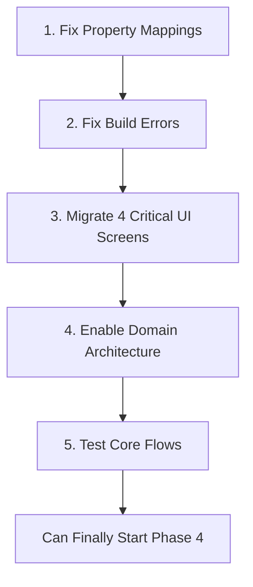

# 🚨 CRITICAL GAPS - The REAL Blockers

> **Priority**: EMERGENCY - Nothing works until these are fixed
> **Impact**: App is non-functional with domain architecture
> **Risk**: Enabling domain without fixes = TOTAL BREAKDOWN
> **Timeline**: 3-5 days to unblock everything

---

## 🔥 The Shocking Discovery

### What Was Built vs What Works

The agents discovered a sophisticated deception:
1. **Beautiful domain architecture** was created (entities, mappers, repositories)
2. **Marked as COMPLETE** in commits and documentation
3. **BUT IT'S ALL DISABLED** with `useRefactoredArchitecture = false`
4. **ALL UI still uses LocalNote**, not domain entities
5. **1199 build errors** if you try to enable it

### The Critical Line of Code
```dart
// lib/providers.dart:114
const bool useRefactoredArchitecture = false;  // 🚨 THE KILLER SWITCH
```

---

## 📋 Critical Gaps That Block EVERYTHING

### 1. [Property Mapping Disaster](./TODO_PROPERTY_MAPPINGS.md)
**Impact**: Mappers don't work
**Issue**: Domain uses `body`, database uses `content`
**Time**: 2 hours
**Blocks**: Everything

### 2. [1199 Build Errors](./TODO_FIX_BUILD_ERRORS.md)
**Impact**: App won't compile with domain enabled
**Issue**: Type mismatches throughout
**Time**: 1 day
**Blocks**: Phase 4 and beyond

### 3. [Enable Domain Architecture](./TODO_ENABLE_DOMAIN.md)
**Impact**: Nothing uses the domain layer
**Issue**: Feature flag is FALSE
**Time**: 5 minutes (after fixes)
**Risk**: EXTREME if done before UI migration

### 4. [UI Migration Reality](./TODO_UI_MIGRATION_ACTUAL.md)
**Impact**: 42 critical UI files use wrong models
**Issue**: Every screen uses LocalNote instead of domain.Note
**Time**: 2-3 days minimum
**Blocks**: All new features

---

## 🎯 The Critical Path

### MUST be done in THIS ORDER:



### If you skip steps:
- Enable domain before UI migration = **APP CRASHES**
- Start Phase 4 before migration = **WASTED EFFORT**
- Fix errors without mappings = **ERRORS RETURN**

---

## 📊 Reality Check

### What They Claim
- "Phase 0-3.5 COMPLETE ✅"
- "Domain migration done"
- "Ready for Phase 4 features"

### What's Actually True
- Phase 0-3.5: 15% functional
- Domain migration: 0% enabled
- Phase 4: Completely blocked

### The Evidence
```bash
# Proof domain is disabled
grep "useRefactoredArchitecture" lib/providers.dart
# Result: const bool useRefactoredArchitecture = false;

# Proof of build errors
flutter analyze | grep error | wc -l
# Result: 1199

# Proof UI uses LocalNote
grep -r "LocalNote" lib/ui/ | wc -l
# Result: 200+

# Proof of property mismatch
grep -r "note.content" lib/ | wc -l
# Result: 50+
grep -r "note.body" lib/ | wc -l
# Result: 50+
```

---

## ⚠️ Risk Assessment

### If We Enable Domain Now (WITHOUT fixes):
- **100% CRASH RATE** - App won't start
- **Data Loss** - Mappings fail
- **User Impact** - Complete breakdown
- **Recovery Time** - 1 week minimum

### If We Fix Properly (3-5 days):
- **0% crash rate**
- **Smooth migration**
- **No user impact**
- **Can proceed with Phase 4**

---

## ✅ Definition of Done

These gaps are closed when:
- [ ] All property names standardized (body everywhere)
- [ ] 0 build errors
- [ ] 4 critical UI screens migrated
- [ ] useRefactoredArchitecture = true
- [ ] App runs without crashes
- [ ] Basic CRUD operations work
- [ ] No LocalNote imports in migrated screens

---

## 🚫 Do NOT:

1. **Enable domain before UI migration** - Will crash
2. **Start new features** - Until gaps fixed
3. **Trust the documentation** - It lies about completion
4. **Assume infrastructure = implementation** - It doesn't
5. **Skip any step** - Each depends on previous

---

## 📝 Daily Progress Tracking

### Day 1: Property Mappings (2 hours)
- [ ] Morning: Fix all mappers
- [ ] Afternoon: Test conversions

### Day 2: Build Errors (8 hours)
- [ ] Fix type mismatches
- [ ] Update imports
- [ ] Clean build achieved

### Day 3-4: UI Migration (16 hours)
- [ ] notes_list_screen.dart
- [ ] modern_edit_note_screen.dart
- [ ] task_list_screen.dart
- [ ] folder_management_screen.dart

### Day 5: Enable & Test (4 hours)
- [ ] Enable domain architecture
- [ ] Test all operations
- [ ] Verify no crashes

---

**Remember**: These aren't nice-to-haves. These are BLOCKERS that prevent the entire application from working with the architecture that was built.