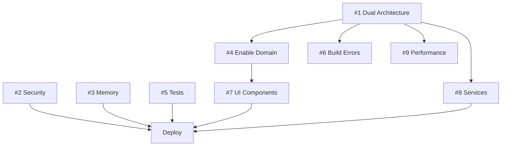

# 🚧 Current Blockers

> **Updated**: December 2024
> **Critical Count**: 5
> **High Count**: 3
> **Medium Count**: 2

---

## 🔴 CRITICAL BLOCKERS (Preventing ANY Progress)

### 1. Dual Architecture Pattern
**Impact**: 40% performance overhead, type safety broken
**Location**: `/lib/providers.dart` (1,669 lines)
**Solution**: Split into modules, remove conditionals
**Time to Fix**: 40 hours
**Assigned**: [UNASSIGNED]
**Status**: NOT STARTED

### 2. Security Vulnerabilities
**Impact**: App is hackable, data at risk
**Issues**: No validation, no rate limiting, no encryption
**Solution**: Implement InputValidationService + middleware
**Time to Fix**: 24 hours
**Assigned**: [UNASSIGNED]
**Status**: NOT STARTED

### 3. Memory Leaks (38 identified)
**Impact**: App crashes after 2 hours
**Issues**: Controllers, streams, timers not disposed
**Solution**: Add disposal in 38 locations
**Time to Fix**: 16 hours
**Assigned**: [UNASSIGNED]
**Status**: NOT STARTED

### 4. Architecture Not Enabled
**Impact**: Domain layer unused despite being built
**Location**: `useRefactoredArchitecture = false`
**Solution**: Fix providers, then enable
**Time to Fix**: 8 hours (after other fixes)
**Assigned**: [UNASSIGNED]
**Status**: BLOCKED BY #1

### 5. Test Coverage (15%)
**Impact**: Can't verify fixes work
**Current**: 15% | **Required**: 70%
**Solution**: Write tests for everything
**Time to Fix**: 60 hours
**Assigned**: [UNASSIGNED]
**Status**: NOT STARTED

---

## 🟡 HIGH PRIORITY BLOCKERS

### 6. Build Errors (422)
**Impact**: CI/CD failing, can't deploy
**Main Issues**: Type errors, missing imports
**Solution**: Fix after architecture cleanup
**Time to Fix**: 16 hours
**Status**: BLOCKED BY #1

### 7. UI Components Using Wrong Models
**Impact**: 43/45 components bypass domain
**Issue**: Direct database model usage
**Solution**: Migrate to domain entities
**Time to Fix**: 60 hours
**Status**: BLOCKED BY #4

### 8. Services Not Migrated (62/73)
**Impact**: Inconsistent architecture
**Issue**: Only 11 services use unified pattern
**Solution**: Migrate remaining 62 services
**Time to Fix**: 80 hours
**Status**: BLOCKED BY #1

---

## 🟠 MEDIUM PRIORITY BLOCKERS

### 9. Performance Degradation
**Impact**: 40% slower than needed
**Cause**: Dual architecture overhead
**Solution**: Remove conditional checks
**Time to Fix**: Included in #1
**Status**: BLOCKED BY #1

### 10. Documentation Out of Date
**Impact**: Claims don't match reality
**Issue**: Says Phase 8 complete, actually Phase 4
**Solution**: Update all docs with reality
**Time to Fix**: 8 hours
**Status**: CAN START ANYTIME

---

## 📊 Blocker Dependencies



---

## ✅ Resolution Order

### Week 1: Critical Foundation
1. Fix Security (#2) - 24 hours
2. Fix Memory Leaks (#3) - 16 hours
3. Remove Dual Architecture (#1) - 40 hours

### Week 2: Enable Architecture
4. Enable Domain (#4) - 8 hours
5. Fix Build Errors (#6) - 16 hours
6. Start UI Migration (#7) - 30 hours

### Week 3: Complete Migration
7. Finish UI Migration (#7) - 30 hours
8. Migrate Services (#8) - 40 hours

### Week 4: Quality
9. Write Tests (#5) - 60 hours
10. Update Documentation (#10) - 8 hours

**Total Time**: 272 hours (34 days at 8 hours/day)

---

## 🔄 Recently Resolved

None yet - all blockers still active.

---

## 📝 Blocker Template

```markdown
### [Number]. [Title]
**Impact**: [Business impact]
**Issue**: [Technical details]
**Solution**: [How to fix]
**Time to Fix**: [Hours]
**Assigned**: [Person]
**Status**: [NOT STARTED | IN PROGRESS | BLOCKED BY #X | RESOLVED]
**Notes**: [Any additional context]
```

---

## 🎯 Success Metrics

Blockers are resolved when:
- [ ] Zero critical blockers
- [ ] Zero high blockers blocking deployment
- [ ] All blockers have owners
- [ ] Daily progress on blocker resolution
- [ ] No new blockers added without resolution plan

---

**Remember**: Fix blockers in order. Don't skip around or you'll create more blockers.