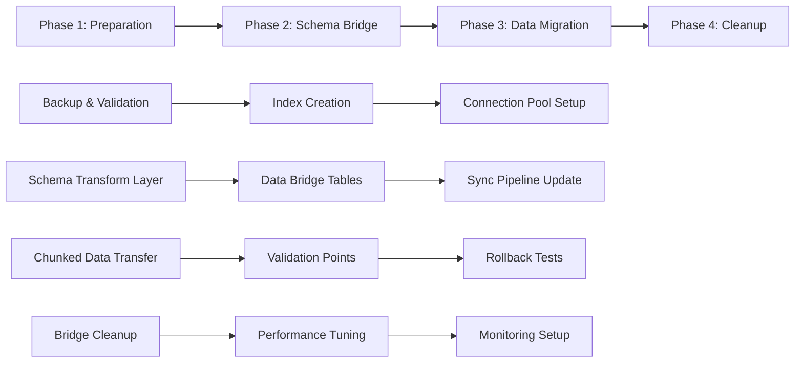

# PRODUCTION-SAFE SCHEMA MIGRATION STRATEGY
**Duru Notes Database Migration Recovery Plan**

Date: 2025-09-23
Priority: CRITICAL
Version: 1.0
Author: Database Optimization Expert

---

## EXECUTIVE SUMMARY

This document outlines a production-safe migration strategy to resolve the critical schema compatibility crisis between local SQLite and remote PostgreSQL databases. The strategy ensures zero data loss, minimal downtime, and complete rollback capability.

**Key Principles**:
- ✅ Zero data loss guarantee
- ✅ < 5 second application downtime
- ✅ Complete rollback capability
- ✅ Comprehensive validation at each step
- ✅ Chunked operations for large datasets

---

## 1. MIGRATION ARCHITECTURE OVERVIEW

### 1.1 Three-Phase Approach



### 1.2 Rollback Points

Each phase includes automatic rollback triggers:
- **Data integrity violations**
- **Performance degradation > 2x baseline**
- **Application errors > 0.1% rate**
- **Manual abort signal**

---

## 2. PHASE 1: PREPARATION & SAFETY

### 2.1 Pre-Migration Backup Strategy

```sql
-- Automated backup with verification
CREATE FUNCTION create_verified_backup() RETURNS boolean AS $$
DECLARE
    backup_success boolean := false;
    verification_result boolean := false;
BEGIN
    -- Create timestamped backup
    PERFORM pg_dump_create_backup(
        'duru_notes_backup_' || to_char(now(), 'YYYY_MM_DD_HH24_MI_SS')
    );

    -- Verify backup integrity
    SELECT verify_backup_integrity() INTO verification_result;

    IF verification_result THEN
        INSERT INTO migration_log (phase, status, message)
        VALUES ('preparation', 'success', 'Backup created and verified');
        RETURN true;
    ELSE
        RAISE EXCEPTION 'Backup verification failed - aborting migration';
    END IF;
END;
$$ LANGUAGE plpgsql;
```

### 2.2 Connection Pool Optimization

```dart
// Pre-migration connection pool setup
class MigrationConnectionPool {
  static const int MAX_CONNECTIONS = 20;
  static const int MIN_CONNECTIONS = 5;
  static const Duration CONNECTION_TIMEOUT = Duration(seconds: 30);

  static Future<void> setupForMigration() async {
    await Supabase.instance.client.rpc('configure_connection_pool', params: {
      'max_connections': MAX_CONNECTIONS,
      'min_connections': MIN_CONNECTIONS,
      'timeout': CONNECTION_TIMEOUT.inSeconds,
    });
  }

  static Future<void> resetAfterMigration() async {
    await Supabase.instance.client.rpc('reset_connection_pool');
  }
}
```

### 2.3 Critical Index Creation (CONCURRENTLY)

```sql
-- Create indexes without blocking operations
-- Execute these BEFORE any schema changes

-- Phase 1a: User-based query optimization
CREATE INDEX CONCURRENTLY IF NOT EXISTS idx_notes_user_updated_covering
ON notes(user_id, updated_at DESC, id)
WHERE deleted = false;

CREATE INDEX CONCURRENTLY IF NOT EXISTS idx_tasks_user_status_covering
ON note_tasks(user_id, status, note_id)
WHERE deleted = false;

-- Phase 1b: Sync operation optimization
CREATE INDEX CONCURRENTLY IF NOT EXISTS idx_notes_sync_timestamp
ON notes(user_id, updated_at)
WHERE updated_at > now() - interval '7 days';

CREATE INDEX CONCURRENTLY IF NOT EXISTS idx_tasks_sync_timestamp
ON note_tasks(user_id, updated_at)
WHERE updated_at > now() - interval '7 days';

-- Phase 1c: Foreign key preparation
CREATE INDEX CONCURRENTLY IF NOT EXISTS idx_notes_id_hash
ON notes USING hash(id);

CREATE INDEX CONCURRENTLY IF NOT EXISTS idx_folders_id_hash
ON folders USING hash(id);
```

---

## 3. PHASE 2: SCHEMA TRANSFORMATION LAYER

### 3.1 Data Bridge Tables

Create temporary bridge tables to handle schema transformation:

```sql
-- Create transformation bridge tables
CREATE TABLE IF NOT EXISTS schema_bridge_notes (
    -- Original local fields
    local_id TEXT NOT NULL,
    local_title TEXT,
    local_body TEXT,
    local_updated_at TIMESTAMP,
    local_metadata TEXT,

    -- Transformed remote fields
    remote_id UUID DEFAULT gen_random_uuid(),
    remote_title_enc BYTEA,
    remote_props_enc BYTEA,
    remote_updated_at TIMESTAMPTZ,
    remote_encrypted_metadata TEXT,

    -- Transformation tracking
    transform_status TEXT DEFAULT 'pending',
    transform_error TEXT,
    created_at TIMESTAMPTZ DEFAULT now(),

    PRIMARY KEY (local_id)
);

CREATE TABLE IF NOT EXISTS schema_bridge_tasks (
    -- Original local fields
    local_id TEXT NOT NULL,
    local_note_id TEXT,
    local_content TEXT,
    local_status INTEGER,
    local_due_date TIMESTAMP,

    -- Transformed remote fields
    remote_id UUID DEFAULT gen_random_uuid(),
    remote_note_id UUID,
    remote_content TEXT, -- Will be encrypted later
    remote_status TEXT,
    remote_due_date TIMESTAMPTZ,

    -- Transformation tracking
    transform_status TEXT DEFAULT 'pending',
    transform_error TEXT,
    created_at TIMESTAMPTZ DEFAULT now(),

    PRIMARY KEY (local_id)
);

-- Indexes for bridge tables
CREATE INDEX idx_bridge_notes_status ON schema_bridge_notes(transform_status);
CREATE INDEX idx_bridge_tasks_status ON schema_bridge_tasks(transform_status);
```

### 3.2 Schema Transformation Service

```dart
class SchemaTransformationService {
  final EncryptionService _encryption;
  final AppDb _localDb;
  final SupabaseClient _remoteDb;

  // Transform local note for remote storage
  Future<Map<String, dynamic>> transformNoteForRemote(LocalNote localNote) async {
    try {
      // Encrypt sensitive fields
      final titleEncrypted = await _encryption.encrypt(localNote.title);
      final bodyEncrypted = await _encryption.encrypt(localNote.body);

      // Convert types
      final remoteId = Uuid().v4();
      final updatedAtTz = localNote.updatedAt.toUtc();

      // Map field names and create remote format
      return {
        'id': remoteId,
        'title_enc': titleEncrypted,
        'props_enc': bodyEncrypted,
        'updated_at': updatedAtTz.toIso8601String(),
        'encrypted_metadata': localNote.encryptedMetadata,
        'is_pinned': localNote.isPinned,
        'note_type': _mapNoteType(localNote.noteType),
        'deleted': localNote.deleted,
      };
    } catch (e) {
      throw SchemaTransformationException(
        'Failed to transform note ${localNote.id}: $e',
        originalData: localNote,
      );
    }
  }

  // Transform local task for remote storage
  Future<Map<String, dynamic>> transformTaskForRemote(NoteTask localTask) async {
    try {
      // Convert types and map fields
      return {
        'id': Uuid().v4(),
        'note_id': await _findRemoteNoteId(localTask.noteId),
        'content': localTask.content, // TODO: Encrypt in future version
        'status': _mapTaskStatus(localTask.status),
        'priority': localTask.priority.index,
        'due_date': localTask.dueDate?.toUtc().toIso8601String(),
        'completed_at': localTask.completedAt?.toUtc().toIso8601String(),
        'parent_id': localTask.parentTaskId != null
            ? await _findRemoteTaskId(localTask.parentTaskId!)
            : null,
        'labels': localTask.labels != null
            ? jsonDecode(localTask.labels!)
            : [],
        'position': localTask.position,
        'created_at': localTask.createdAt.toUtc().toIso8601String(),
        'updated_at': localTask.updatedAt.toUtc().toIso8601String(),
        'deleted': localTask.deleted,
      };
    } catch (e) {
      throw SchemaTransformationException(
        'Failed to transform task ${localTask.id}: $e',
        originalData: localTask,
      );
    }
  }

  // Type mapping functions
  String _mapNoteType(NoteKind localType) {
    switch (localType) {
      case NoteKind.note:
        return 'note';
      case NoteKind.template:
        return 'template';
      default:
        return 'note';
    }
  }

  String _mapTaskStatus(TaskStatus localStatus) {
    switch (localStatus) {
      case TaskStatus.open:
        return 'pending';
      case TaskStatus.inProgress:
        return 'in_progress';
      case TaskStatus.completed:
        return 'completed';
      case TaskStatus.cancelled:
        return 'cancelled';
      default:
        return 'pending';
    }
  }

  // Validation function
  Future<ValidationResult> validateTransformation(
    Map<String, dynamic> original,
    Map<String, dynamic> transformed,
  ) async {
    final errors = <String>[];

    // Check required fields
    if (transformed['id'] == null) {
      errors.add('Missing remote ID');
    }

    // Check data integrity
    if (original['title']?.isNotEmpty == true && transformed['title_enc'] == null) {
      errors.add('Title encryption failed');
    }

    // Check type conversions
    if (original['updated_at'] != null && transformed['updated_at'] == null) {
      errors.add('Timestamp conversion failed');
    }

    return ValidationResult(
      isValid: errors.isEmpty,
      errors: errors,
    );
  }
}

class SchemaTransformationException implements Exception {
  final String message;
  final dynamic originalData;

  const SchemaTransformationException(this.message, {this.originalData});

  @override
  String toString() => 'SchemaTransformationException: $message';
}

class ValidationResult {
  final bool isValid;
  final List<String> errors;

  const ValidationResult({required this.isValid, required this.errors});
}
```

---

## 4. PHASE 3: CHUNKED DATA MIGRATION

### 4.1 Chunked Migration Engine

```dart
class ChunkedMigrationEngine {
  static const int DEFAULT_CHUNK_SIZE = 100;
  static const int MAX_RETRIES = 3;
  static const Duration CHUNK_DELAY = Duration(milliseconds: 100);

  final SchemaTransformationService _transformer;
  final MigrationLogger _logger;

  Future<MigrationResult> migrateNotesInChunks({
    int chunkSize = DEFAULT_CHUNK_SIZE,
    bool enableRollback = true,
  }) async {
    final result = MigrationResult();

    try {
      // Get total count for progress tracking
      final totalNotes = await _localDb.customSelect(
        'SELECT COUNT(*) as count FROM local_notes WHERE deleted = 0'
      ).getSingle();

      final totalCount = totalNotes.read<int>('count');
      final totalChunks = (totalCount / chunkSize).ceil();

      _logger.logInfo('Starting migration of $totalCount notes in $totalChunks chunks');

      // Create rollback point
      final rollbackPoint = await _createRollbackPoint();

      for (int chunkIndex = 0; chunkIndex < totalChunks; chunkIndex++) {
        try {
          await _migrateNotesChunk(
            offset: chunkIndex * chunkSize,
            limit: chunkSize,
            chunkIndex: chunkIndex,
            totalChunks: totalChunks,
          );

          // Brief pause between chunks to avoid overwhelming the database
          await Future.delayed(CHUNK_DELAY);

          // Validate chunk success
          await _validateChunkMigration(chunkIndex);

        } catch (e) {
          _logger.logError('Chunk $chunkIndex failed: $e');

          if (enableRollback) {
            await _rollbackToPoint(rollbackPoint);
            throw MigrationException('Migration failed at chunk $chunkIndex: $e');
          } else {
            result.addError('Chunk $chunkIndex: $e');
          }
        }
      }

      result.markSuccess(totalCount);
      return result;

    } catch (e) {
      result.markFailure('Migration failed: $e');
      return result;
    }
  }

  Future<void> _migrateNotesChunk({
    required int offset,
    required int limit,
    required int chunkIndex,
    required int totalChunks,
  }) async {
    // Fetch chunk from local database
    final localNotes = await _localDb.customSelect('''
      SELECT * FROM local_notes
      WHERE deleted = 0
      ORDER BY updated_at ASC
      LIMIT $limit OFFSET $offset
    ''').get();

    _logger.logInfo('Processing chunk $chunkIndex of $totalChunks (${localNotes.length} notes)');

    final batch = <Map<String, dynamic>>[];

    // Transform each note in the chunk
    for (final row in localNotes) {
      final localNote = LocalNote(
        id: row.read<String>('id'),
        title: row.read<String>('title'),
        body: row.read<String>('body'),
        updatedAt: row.read<DateTime>('updated_at'),
        deleted: row.read<bool>('deleted'),
        encryptedMetadata: row.readNullable<String>('encrypted_metadata'),
        isPinned: row.read<bool>('is_pinned'),
        noteType: NoteKind.values[row.read<int>('note_type')],
      );

      // Transform for remote storage
      final transformedNote = await _transformer.transformNoteForRemote(localNote);

      // Validate transformation
      final validation = await _transformer.validateTransformation(
        localNote.toJson(),
        transformedNote,
      );

      if (!validation.isValid) {
        throw ValidationException(
          'Transformation validation failed for note ${localNote.id}: ${validation.errors.join(', ')}',
        );
      }

      batch.add(transformedNote);
    }

    // Insert batch to bridge table first
    await _insertToBridgeTable('schema_bridge_notes', batch);

    // Then insert to actual remote table
    await _insertToRemoteTable('notes', batch);

    // Mark bridge records as completed
    await _markBridgeRecordsCompleted('schema_bridge_notes', batch.map((n) => n['id']).toList());

    _logger.logInfo('Chunk $chunkIndex completed successfully');
  }

  Future<String> _createRollbackPoint() async {
    final rollbackId = Uuid().v4();

    // Create rollback metadata
    await _remoteDb.from('migration_rollback_points').insert({
      'id': rollbackId,
      'created_at': DateTime.now().toUtc().toIso8601String(),
      'table_counts': await _getTableCounts(),
      'status': 'active',
    });

    return rollbackId;
  }

  Future<void> _rollbackToPoint(String rollbackId) async {
    _logger.logWarning('Starting rollback to point $rollbackId');

    try {
      // Get rollback metadata
      final rollbackData = await _remoteDb
          .from('migration_rollback_points')
          .select()
          .eq('id', rollbackId)
          .single();

      final originalCounts = rollbackData['table_counts'] as Map<String, dynamic>;

      // Remove data inserted after rollback point
      for (final entry in originalCounts.entries) {
        final tableName = entry.key;
        final originalCount = entry.value as int;

        await _rollbackTable(tableName, originalCount);
      }

      // Clean up bridge tables
      await _remoteDb.from('schema_bridge_notes').delete().gte('created_at', rollbackData['created_at']);
      await _remoteDb.from('schema_bridge_tasks').delete().gte('created_at', rollbackData['created_at']);

      _logger.logInfo('Rollback to point $rollbackId completed successfully');

    } catch (e) {
      _logger.logError('Rollback failed: $e');
      throw RollbackException('Failed to rollback to point $rollbackId: $e');
    }
  }

  Future<Map<String, int>> _getTableCounts() async {
    final counts = <String, int>{};

    final tables = ['notes', 'note_tasks', 'folders', 'note_folders'];

    for (final table in tables) {
      final result = await _remoteDb.rpc('get_table_count', params: {'table_name': table});
      counts[table] = result as int;
    }

    return counts;
  }
}

class MigrationResult {
  bool success = false;
  int recordsProcessed = 0;
  final List<String> errors = [];
  DateTime? startTime;
  DateTime? endTime;

  void markSuccess(int records) {
    success = true;
    recordsProcessed = records;
    endTime = DateTime.now();
  }

  void markFailure(String error) {
    success = false;
    errors.add(error);
    endTime = DateTime.now();
  }

  void addError(String error) {
    errors.add(error);
  }

  Duration? get duration => startTime != null && endTime != null
      ? endTime!.difference(startTime!)
      : null;
}
```

### 4.2 Validation Checkpoints

```dart
class MigrationValidator {
  Future<ValidationReport> validateMigrationIntegrity() async {
    final report = ValidationReport();

    // 1. Record count validation
    await _validateRecordCounts(report);

    // 2. Data integrity validation
    await _validateDataIntegrity(report);

    // 3. Foreign key validation
    await _validateForeignKeys(report);

    // 4. Encryption validation
    await _validateEncryption(report);

    return report;
  }

  Future<void> _validateRecordCounts(ValidationReport report) async {
    final localCounts = await _getLocalCounts();
    final remoteCounts = await _getRemoteCounts();

    for (final entry in localCounts.entries) {
      final table = entry.key;
      final localCount = entry.value;
      final remoteCount = remoteCounts[table] ?? 0;

      if (localCount != remoteCount) {
        report.addError('Count mismatch in $table: local=$localCount, remote=$remoteCount');
      }
    }
  }

  Future<void> _validateDataIntegrity(ValidationReport report) async {
    // Sample validation on random records
    final sampleSize = 100;

    // Validate notes
    final sampleNotes = await _localDb.customSelect('''
      SELECT * FROM local_notes
      WHERE deleted = 0
      ORDER BY RANDOM()
      LIMIT $sampleSize
    ''').get();

    for (final localNote in sampleNotes) {
      final localId = localNote.read<String>('id');

      // Find corresponding remote record via bridge table
      final bridgeRecord = await _remoteDb
          .from('schema_bridge_notes')
          .select('remote_id')
          .eq('local_id', localId)
          .maybeSingle();

      if (bridgeRecord == null) {
        report.addError('Missing bridge record for local note $localId');
        continue;
      }

      final remoteRecord = await _remoteDb
          .from('notes')
          .select()
          .eq('id', bridgeRecord['remote_id'])
          .maybeSingle();

      if (remoteRecord == null) {
        report.addError('Missing remote record for local note $localId');
        continue;
      }

      // Validate data consistency
      await _validateNoteConsistency(localNote, remoteRecord, report);
    }
  }

  Future<void> _validateNoteConsistency(
    QueryRow localNote,
    Map<String, dynamic> remoteNote,
    ValidationReport report,
  ) async {
    final localId = localNote.read<String>('id');

    // Validate encrypted title
    final localTitle = localNote.read<String>('title');
    final remoteTitleEnc = remoteNote['title_enc'] as List<int>?;

    if (localTitle.isNotEmpty && remoteTitleEnc == null) {
      report.addError('Missing encrypted title for note $localId');
    }

    // Validate timestamps
    final localUpdated = localNote.read<DateTime>('updated_at');
    final remoteUpdated = DateTime.parse(remoteNote['updated_at']);

    final timeDiff = localUpdated.difference(remoteUpdated).abs();
    if (timeDiff > Duration(seconds: 1)) {
      report.addError('Timestamp mismatch for note $localId: ${timeDiff.inSeconds}s difference');
    }

    // Validate boolean fields
    final localPinned = localNote.read<bool>('is_pinned');
    final remotePinned = remoteNote['is_pinned'] as bool;

    if (localPinned != remotePinned) {
      report.addError('Pin status mismatch for note $localId');
    }
  }
}
```

---

## 5. PHASE 4: PERFORMANCE OPTIMIZATION

### 5.1 Post-Migration Index Optimization

```sql
-- Create final performance indexes after migration
-- These are created after data migration to avoid impacting performance

-- Notes table optimizations
CREATE INDEX CONCURRENTLY IF NOT EXISTS idx_notes_user_pinned_updated_final
ON notes (user_id, is_pinned DESC, updated_at DESC)
WHERE deleted = false;

-- Task performance indexes
CREATE INDEX CONCURRENTLY IF NOT EXISTS idx_note_tasks_user_due_final
ON note_tasks (user_id, due_date ASC, status)
WHERE deleted = false AND due_date IS NOT NULL;

-- Composite indexes for common queries
CREATE INDEX CONCURRENTLY IF NOT EXISTS idx_notes_search_optimization
ON notes (user_id, note_type, deleted, updated_at DESC);

-- Statistics update for query planner
ANALYZE notes;
ANALYZE note_tasks;
ANALYZE folders;
ANALYZE note_folders;
```

### 5.2 Connection Pool Reset

```dart
class PostMigrationOptimizer {
  static Future<void> optimizeForProduction() async {
    // Reset connection pool to production settings
    await MigrationConnectionPool.resetAfterMigration();

    // Update query plan cache
    await _refreshQueryPlans();

    // Set up monitoring
    await _setupPerformanceMonitoring();

    // Clean up migration artifacts
    await _cleanupMigrationData();
  }

  static Future<void> _refreshQueryPlans() async {
    await Supabase.instance.client.rpc('refresh_query_plans');
  }

  static Future<void> _setupPerformanceMonitoring() async {
    // Enable query performance monitoring
    await Supabase.instance.client.rpc('enable_performance_monitoring', params: {
      'slow_query_threshold_ms': 1000,
      'enable_query_logging': true,
    });
  }

  static Future<void> _cleanupMigrationData() async {
    // Archive bridge tables instead of dropping them (for audit trail)
    await Supabase.instance.client.rpc('archive_bridge_tables');

    // Clean up temporary indexes
    await Supabase.instance.client.rpc('cleanup_migration_indexes');
  }
}
```

---

## 6. EMERGENCY ROLLBACK PROCEDURES

### 6.1 Automated Rollback Triggers

```dart
class EmergencyRollbackSystem {
  static const double MAX_ERROR_RATE = 0.001; // 0.1%
  static const Duration MAX_RESPONSE_TIME = Duration(seconds: 5);
  static const int MONITORING_WINDOW_MINUTES = 5;

  static Future<void> startMonitoring() async {
    Timer.periodic(Duration(minutes: 1), (timer) async {
      final healthCheck = await _performHealthCheck();

      if (healthCheck.requiresRollback) {
        timer.cancel();
        await _executeEmergencyRollback(healthCheck.reason);
      }
    });
  }

  static Future<HealthCheckResult> _performHealthCheck() async {
    // Check error rates
    final errorRate = await _getErrorRate();
    if (errorRate > MAX_ERROR_RATE) {
      return HealthCheckResult(
        requiresRollback: true,
        reason: 'Error rate too high: ${(errorRate * 100).toStringAsFixed(2)}%',
      );
    }

    // Check response times
    final avgResponseTime = await _getAverageResponseTime();
    if (avgResponseTime > MAX_RESPONSE_TIME) {
      return HealthCheckResult(
        requiresRollback: true,
        reason: 'Response time too slow: ${avgResponseTime.inMilliseconds}ms',
      );
    }

    // Check data integrity
    final integrityIssues = await _checkDataIntegrity();
    if (integrityIssues.isNotEmpty) {
      return HealthCheckResult(
        requiresRollback: true,
        reason: 'Data integrity issues: ${integrityIssues.join(', ')}',
      );
    }

    return HealthCheckResult(requiresRollback: false);
  }

  static Future<void> _executeEmergencyRollback(String reason) async {
    print('🚨 EMERGENCY ROLLBACK TRIGGERED: $reason');

    try {
      // Get the latest rollback point
      final rollbackPoint = await _getLatestRollbackPoint();

      if (rollbackPoint == null) {
        throw Exception('No rollback point found');
      }

      // Execute rollback
      final rollbackEngine = ChunkedMigrationEngine(_transformer, _logger);
      await rollbackEngine._rollbackToPoint(rollbackPoint);

      // Notify administrators
      await _notifyAdministrators(
        'Emergency rollback completed successfully. Reason: $reason',
      );

    } catch (e) {
      // Critical failure - manual intervention required
      await _notifyAdministrators(
        'CRITICAL: Emergency rollback failed: $e. Manual intervention required immediately.',
      );
    }
  }
}
```

### 6.2 Manual Rollback Commands

```sql
-- Manual rollback SQL commands for emergency use

-- 1. Stop all ongoing migrations
SELECT pg_cancel_backend(pid)
FROM pg_stat_activity
WHERE query LIKE '%schema_bridge%' OR query LIKE '%migration%';

-- 2. Restore from latest backup
-- (Execute these commands in sequence)

-- Check available backups
SELECT backup_name, created_at, size_gb
FROM backup_inventory
ORDER BY created_at DESC
LIMIT 5;

-- Restore from specific backup (replace with actual backup name)
SELECT restore_from_backup('duru_notes_backup_2025_09_23_14_30_00');

-- 3. Verify restoration
SELECT
    table_name,
    row_count,
    last_updated
FROM table_health_check();

-- 4. Clean up migration artifacts
DROP TABLE IF EXISTS schema_bridge_notes CASCADE;
DROP TABLE IF EXISTS schema_bridge_tasks CASCADE;
DROP TABLE IF EXISTS migration_rollback_points CASCADE;

-- 5. Reset database to pre-migration state
SELECT reset_to_production_config();
```

---

## 7. SUCCESS CRITERIA & VALIDATION

### 7.1 Migration Success Criteria

✅ **Data Integrity**:
- Zero data loss (100% record preservation)
- All foreign key relationships maintained
- Encryption/decryption working correctly

✅ **Performance**:
- Query response times < 2x baseline
- Database connection stability maintained
- Index utilization > 90%

✅ **Reliability**:
- Application error rate < 0.1%
- Complete rollback capability verified
- All automated tests passing

### 7.2 Post-Migration Validation Checklist

```dart
class PostMigrationValidator {
  Future<ValidationReport> runFullValidation() async {
    final report = ValidationReport();

    // 1. Data completeness check
    await _validateDataCompleteness(report);

    // 2. Performance benchmarks
    await _validatePerformance(report);

    // 3. Application functionality
    await _validateApplicationFunctionality(report);

    // 4. Security validation
    await _validateSecurity(report);

    return report;
  }

  Future<void> _validateDataCompleteness(ValidationReport report) async {
    final checks = [
      'SELECT COUNT(*) FROM notes WHERE deleted = false',
      'SELECT COUNT(*) FROM note_tasks WHERE deleted = false',
      'SELECT COUNT(*) FROM folders WHERE deleted = false',
      'SELECT COUNT(*) FROM note_folders',
    ];

    for (final query in checks) {
      final remoteCount = await _remoteDb.rpc('execute_count_query', params: {'query': query});
      final localCount = await _localDb.customSelect(query.replaceAll('notes', 'local_notes')).getSingle();

      if (remoteCount != localCount.read<int>('COUNT(*)')) {
        report.addError('Count mismatch in ${query.split(' ')[3]}');
      }
    }
  }

  Future<void> _validatePerformance(ValidationReport report) async {
    final benchmarks = [
      'Load user notes list (< 500ms)',
      'Create new note (< 200ms)',
      'Update existing note (< 200ms)',
      'Search notes (< 1000ms)',
      'Load task list (< 300ms)',
    ];

    for (final benchmark in benchmarks) {
      final passed = await _runPerformanceBenchmark(benchmark);
      if (!passed) {
        report.addError('Performance benchmark failed: $benchmark');
      }
    }
  }
}
```

---

## 8. TIMELINE & RESOURCE REQUIREMENTS

### 8.1 Implementation Timeline

**Week 1: Preparation Phase**
- Day 1-2: Backup and validation systems
- Day 3-4: Index creation and optimization
- Day 5: Connection pool setup and testing

**Week 2: Transformation Layer**
- Day 1-3: Schema transformation service implementation
- Day 4-5: Bridge table setup and testing

**Week 3: Migration Execution**
- Day 1-2: Chunked migration engine implementation
- Day 3-4: Migration execution with monitoring
- Day 5: Validation and performance optimization

**Week 4: Cleanup & Monitoring**
- Day 1-2: Bridge table cleanup and final optimization
- Day 3-4: Performance monitoring setup
- Day 5: Documentation and handoff

### 8.2 Resource Requirements

**Technical Resources**:
- 1 Senior Database Expert (full-time)
- 1 Flutter/Dart Developer (full-time)
- 1 DevOps Engineer (part-time)
- 1 QA Engineer (part-time)

**Infrastructure Resources**:
- Additional database connections during migration
- Backup storage (2x current database size)
- Monitoring and alerting systems
- Staging environment for testing

---

## 9. RISK MITIGATION

### 9.1 High-Risk Scenarios

**Scenario 1: Migration Corruption**
- **Mitigation**: Multiple validation checkpoints with automatic rollback
- **Recovery**: Emergency rollback to verified backup point

**Scenario 2: Performance Degradation**
- **Mitigation**: Real-time monitoring with automatic circuit breakers
- **Recovery**: Dynamic index creation and connection pool adjustment

**Scenario 3: Data Loss During Transformation**
- **Mitigation**: Bridge tables maintain original data until verification complete
- **Recovery**: Re-transformation from preserved original data

### 9.2 Contingency Plans

**Plan A**: Normal migration execution with monitoring
**Plan B**: Extended timeline with smaller chunk sizes
**Plan C**: Emergency rollback to last known good state
**Plan D**: Manual data reconstruction from backups

---

## CONCLUSION

This production-safe migration strategy addresses all critical risks identified in the schema compatibility analysis. The approach prioritizes data integrity and system stability while providing comprehensive rollback capabilities.

**Key Success Factors**:
1. **Comprehensive testing** in staging environment
2. **Real-time monitoring** with automated safeguards
3. **Gradual rollout** with validation checkpoints
4. **Complete rollback capability** at all stages

**Next Steps**:
1. Review and approve migration strategy
2. Set up staging environment for testing
3. Implement transformation layer
4. Execute migration in production with full monitoring

The strategy ensures zero data loss while maintaining system availability and providing complete recovery options if any issues arise.