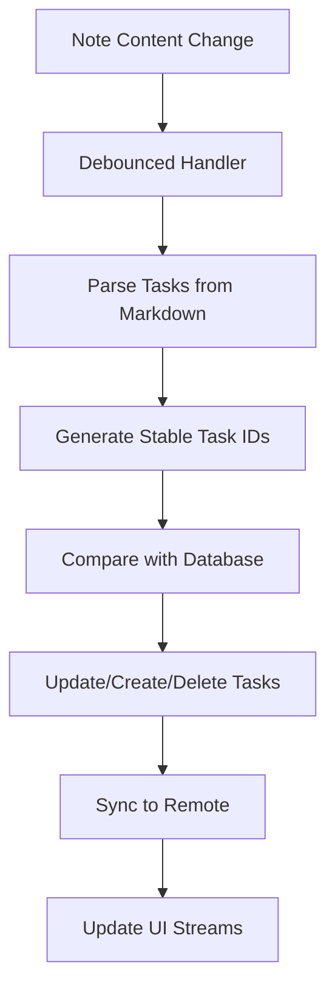

# Sync Optimization Patterns for Duru Notes

## Current Sync Architecture Analysis

The Duru Notes sync system implements sophisticated bidirectional synchronization between local Drift database and remote Supabase. Here's an analysis of current patterns and optimization opportunities.

### Current Sync Flow



## Optimization Patterns

### 1. **Differential Sync Pattern**

**Current Issue**: Full content parsing on every change
```dart
// From UnifiedTaskService.syncFromNoteToTasks()
final taskMappings = _parseTasksWithLineTracking(noteId, noteContent);
final existingTasks = await getTasksForNote(noteId);
```

**Optimized Pattern**:
```dart
class DifferentialSyncService {
  final Map<String, String> _lastSyncedContent = {};
  final Map<String, List<String>> _lastTaskHashes = {};

  Future<void> syncFromNoteToTasks(String noteId, String noteContent) async {
    final lastContent = _lastSyncedContent[noteId];
    final lastHashes = _lastTaskHashes[noteId] ?? [];

    // Quick content hash comparison
    final currentContentHash = _hashContent(noteContent);
    final lastContentHash = lastContent != null ? _hashContent(lastContent) : '';

    if (currentContentHash == lastContentHash) {
      return; // No changes
    }

    // Parse only changed lines
    final changedLines = _getChangedLines(lastContent, noteContent);
    final affectedTasks = _parseChangedTasks(changedLines);

    // Process only affected tasks
    await _syncAffectedTasks(noteId, affectedTasks);

    // Update cache
    _lastSyncedContent[noteId] = noteContent;
    _lastTaskHashes[noteId] = _extractCurrentTaskHashes(noteContent);
  }

  List<int> _getChangedLines(String? oldContent, String newContent) {
    if (oldContent == null) return List.generate(newContent.split('\n').length, (i) => i);

    final oldLines = oldContent.split('\n');
    final newLines = newContent.split('\n');
    final changedLines = <int>[];

    for (int i = 0; i < newLines.length; i++) {
      if (i >= oldLines.length || oldLines[i] != newLines[i]) {
        changedLines.add(i);
      }
    }

    return changedLines;
  }
}
```

### 2. **Conflict-Free Sync Pattern**

**Current Challenge**: Race conditions between note edits and task updates

**CRDT-Inspired Solution**:
```dart
class ConflictFreeSyncService {
  // Vector clocks for conflict resolution
  final Map<String, Map<String, int>> _vectorClocks = {};

  Future<void> syncTaskChange(String taskId, TaskChange change) async {
    final clock = _getVectorClock(taskId);
    clock[_localNodeId] = (clock[_localNodeId] ?? 0) + 1;

    final changeEvent = ChangeEvent(
      taskId: taskId,
      change: change,
      vectorClock: Map.from(clock),
      timestamp: DateTime.now(),
    );

    // Apply locally
    await _applyChange(changeEvent);

    // Queue for remote sync
    await _queueRemoteSync(changeEvent);
  }

  Future<void> _resolveConflicts(List<ChangeEvent> events) async {
    // Sort by vector clock ordering
    events.sort((a, b) => _compareVectorClocks(a.vectorClock, b.vectorClock));

    for (final event in events) {
      if (_canApplyChange(event)) {
        await _applyChange(event);
      }
    }
  }
}
```

### 3. **Optimistic Updates with Rollback**

**Enhanced Pattern for Flutter**:
```dart
class OptimisticSyncService {
  final Map<String, PendingOperation> _pendingOps = {};

  Future<void> optimisticTaskUpdate({
    required String taskId,
    required TaskStatus newStatus,
  }) async {
    final operationId = _generateOperationId();

    try {
      // 1. Immediate UI update
      await _applyOptimisticUpdate(taskId, newStatus, operationId);

      // 2. Local database update
      await _db.updateTask(taskId, status: newStatus);

      // 3. Queue remote sync (fire and forget)
      _queueRemoteSync(operationId, taskId, newStatus);

    } catch (e) {
      // Rollback optimistic update
      await _rollbackOptimisticUpdate(operationId);
      rethrow;
    }
  }

  Future<void> _applyOptimisticUpdate(
    String taskId,
    TaskStatus newStatus,
    String operationId,
  ) async {
    _pendingOps[operationId] = PendingOperation(
      taskId: taskId,
      originalStatus: await _getCurrentStatus(taskId),
      newStatus: newStatus,
    );

    // Update in-memory state immediately
    _taskStateCache[taskId] = _taskStateCache[taskId]?.copyWith(
      status: newStatus,
      isPending: true,
    );

    // Notify UI
    _taskUpdateController.add(TaskUpdate.optimistic(taskId));
  }
}
```

### 4. **Efficient Real-time Sync Pattern**

**Current Issue**: Individual Supabase subscriptions per note

**Multiplexed Subscription Pattern**:
```dart
class MultiplexedRealtimeService {
  StreamSubscription<List<Map<String, dynamic>>>? _notesSubscription;
  StreamSubscription<List<Map<String, dynamic>>>? _foldersSubscription;

  final _noteUpdateController = StreamController<NoteUpdate>.broadcast();
  final _folderUpdateController = StreamController<FolderUpdate>.broadcast();

  void initialize() {
    // Single subscription for all notes
    _notesSubscription = _supabase
        .from('notes')
        .stream(primaryKey: ['id'])
        .eq('user_id', _userId)
        .listen(_handleNoteUpdates);

    // Single subscription for all folders
    _foldersSubscription = _supabase
        .from('folders')
        .stream(primaryKey: ['id'])
        .eq('user_id', _userId)
        .listen(_handleFolderUpdates);
  }

  void _handleNoteUpdates(List<Map<String, dynamic>> updates) {
    for (final update in updates) {
      final noteId = update['id'] as String;
      final updateType = _determineUpdateType(update);

      _noteUpdateController.add(NoteUpdate(
        noteId: noteId,
        type: updateType,
        data: update,
      ));
    }
  }

  // Expose filtered streams for specific notes
  Stream<NoteUpdate> getUpdatesForNote(String noteId) {
    return _noteUpdateController.stream
        .where((update) => update.noteId == noteId);
  }
}
```

### 5. **Background Sync Queue Pattern**

**Robust Offline-to-Online Sync**:
```dart
class BackgroundSyncQueue {
  final Queue<SyncOperation> _operationQueue = Queue();
  bool _isProcessing = false;

  Future<void> queueOperation(SyncOperation operation) async {
    _operationQueue.add(operation);

    // Persist queue to survive app restarts
    await _persistQueue();

    if (!_isProcessing) {
      unawaited(_processQueue());
    }
  }

  Future<void> _processQueue() async {
    _isProcessing = true;

    while (_operationQueue.isNotEmpty) {
      final operation = _operationQueue.removeFirst();

      try {
        await _executeOperation(operation);
        await _removeFromPersistedQueue(operation.id);
      } catch (e) {
        if (_shouldRetry(operation, e)) {
          operation.incrementRetryCount();
          _operationQueue.add(operation); // Re-queue
        } else {
          // Handle permanent failure
          await _handlePermanentFailure(operation, e);
        }
      }

      // Rate limiting
      await Future.delayed(const Duration(milliseconds: 100));
    }

    _isProcessing = false;
  }

  Future<void> _executeOperation(SyncOperation operation) async {
    switch (operation.type) {
      case SyncOperationType.upsertNote:
        await _syncNoteToRemote(operation);
        break;
      case SyncOperationType.deleteNote:
        await _deleteNoteFromRemote(operation);
        break;
      case SyncOperationType.upsertFolder:
        await _syncFolderToRemote(operation);
        break;
    }
  }
}
```

### 6. **Memory-Efficient Sync Pattern**

**Streaming Sync for Large Datasets**:
```dart
class StreamingSyncService {
  Future<void> syncLargeDataset() async {
    const batchSize = 100;
    int offset = 0;

    await for (final batch in _getBatchStream(batchSize, offset)) {
      await _processBatch(batch);

      // Allow UI to breathe between batches
      await Future.delayed(const Duration(milliseconds: 10));

      offset += batchSize;
    }
  }

  Stream<List<LocalNote>> _getBatchStream(int batchSize, int initialOffset) async* {
    int currentOffset = initialOffset;

    while (true) {
      final batch = await _db.select(_db.localNotes)
          .limit(batchSize, offset: currentOffset)
          .get();

      if (batch.isEmpty) break;

      yield batch;
      currentOffset += batchSize;
    }
  }

  Future<void> _processBatch(List<LocalNote> notes) async {
    // Process in parallel with controlled concurrency
    final futures = notes.map((note) => _syncSingleNote(note));
    await Future.wait(futures, eagerError: false);
  }
}
```

### 7. **Smart Debouncing Pattern**

**Adaptive Debouncing Based on Change Frequency**:
```dart
class AdaptiveDebouncingService {
  final Map<String, AdaptiveDebouncer> _debouncers = {};

  void scheduleSync(String noteId, String content) {
    final debouncer = _debouncers.putIfAbsent(
      noteId,
      () => AdaptiveDebouncer(
        minDelay: const Duration(milliseconds: 300),
        maxDelay: const Duration(milliseconds: 2000),
        callback: (content) => _performSync(noteId, content),
      ),
    );

    debouncer.trigger(content);
  }
}

class AdaptiveDebouncer {
  final Duration minDelay;
  final Duration maxDelay;
  final Function(String) callback;

  Timer? _timer;
  int _changeCount = 0;
  DateTime _lastChange = DateTime.now();

  AdaptiveDebouncer({
    required this.minDelay,
    required this.maxDelay,
    required this.callback,
  });

  void trigger(String content) {
    final now = DateTime.now();

    // Increase delay for rapid changes
    if (now.difference(_lastChange) < const Duration(seconds: 1)) {
      _changeCount++;
    } else {
      _changeCount = 0;
    }

    _lastChange = now;

    final delay = Duration(
      milliseconds: (minDelay.inMilliseconds * (1 + _changeCount * 0.5))
          .clamp(minDelay.inMilliseconds, maxDelay.inMilliseconds)
          .round(),
    );

    _timer?.cancel();
    _timer = Timer(delay, () => callback(content));
  }
}
```

## Performance Monitoring

```dart
class SyncMetrics {
  static final _syncDurations = <String, List<Duration>>{};

  static void recordSyncDuration(String operation, Duration duration) {
    _syncDurations.putIfAbsent(operation, () => []).add(duration);

    if (duration.inMilliseconds > 1000) {
      FirebaseCrashlytics.instance.log(
        'Slow sync operation: $operation took ${duration.inMilliseconds}ms',
      );
    }
  }

  static Map<String, double> getAverageDurations() {
    return _syncDurations.map((key, durations) {
      final avg = durations.map((d) => d.inMilliseconds).reduce((a, b) => a + b) / durations.length;
      return MapEntry(key, avg);
    });
  }
}
```

These patterns address the core challenges in your sync architecture while maintaining the excellent offline-first experience. The key is implementing them incrementally, starting with the highest-impact optimizations like differential sync and optimistic updates.