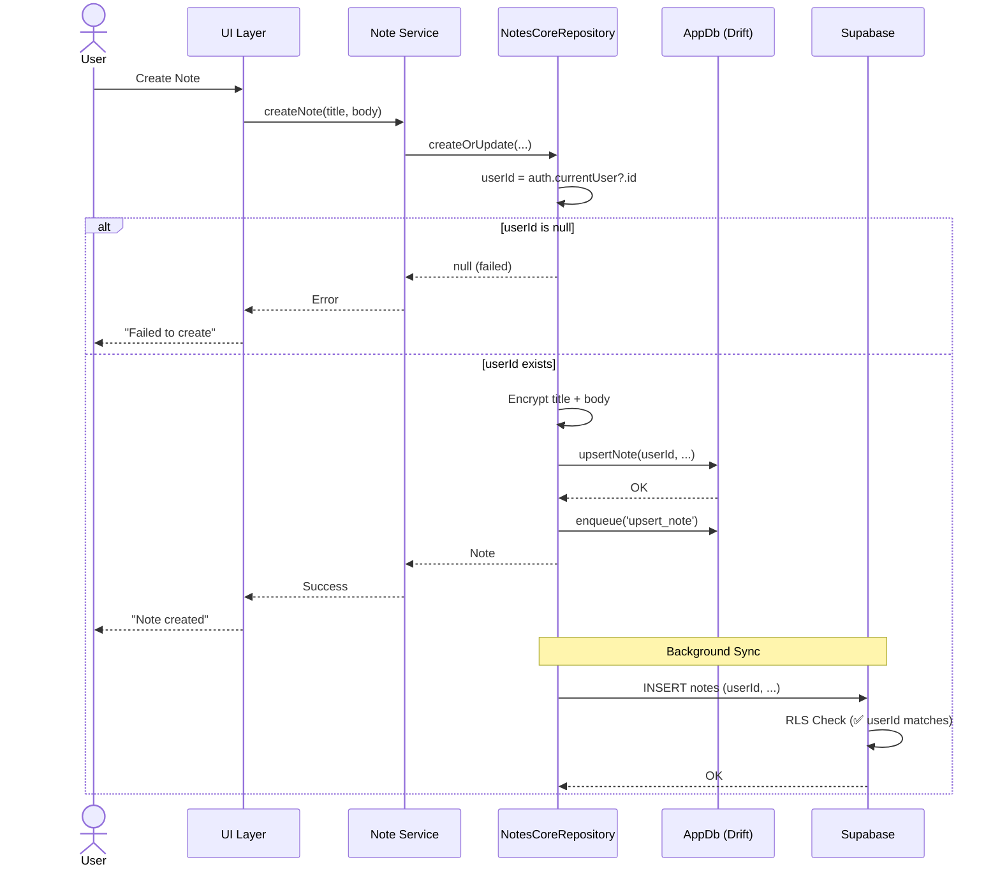
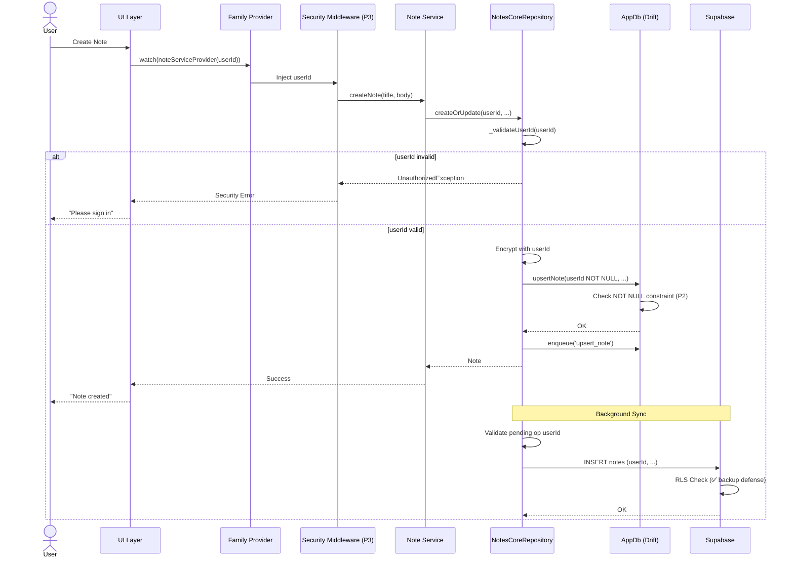
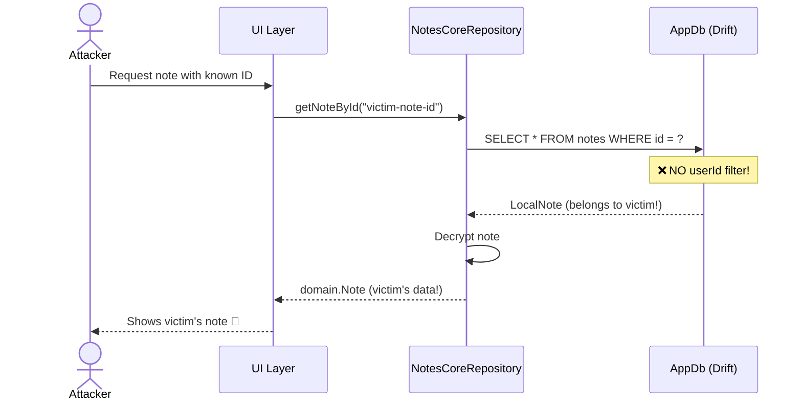
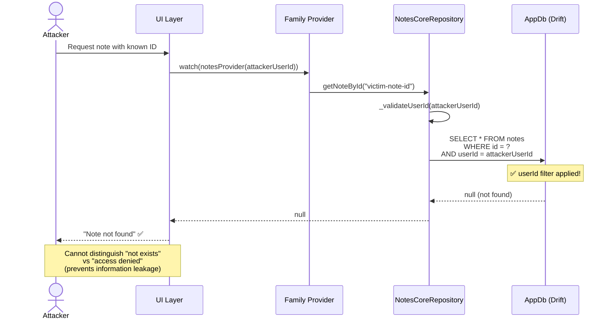
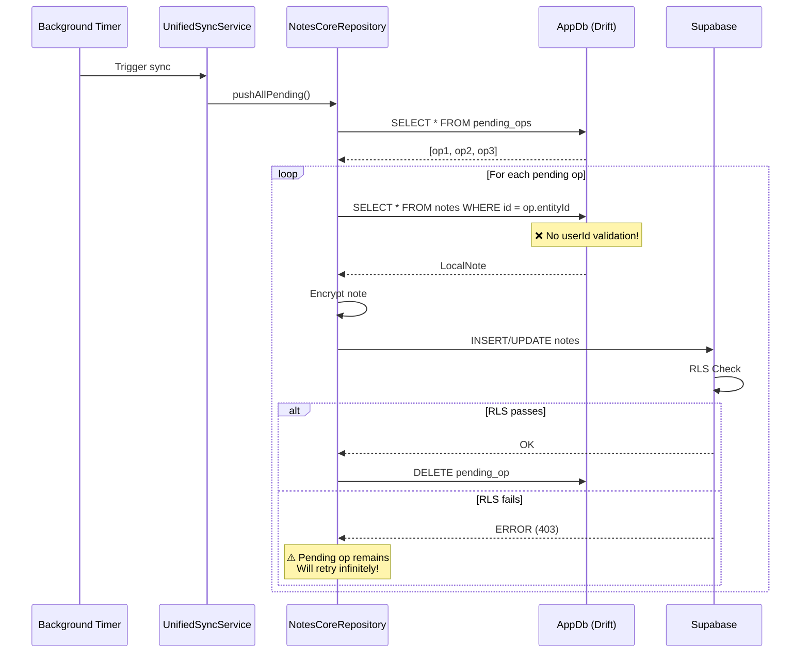
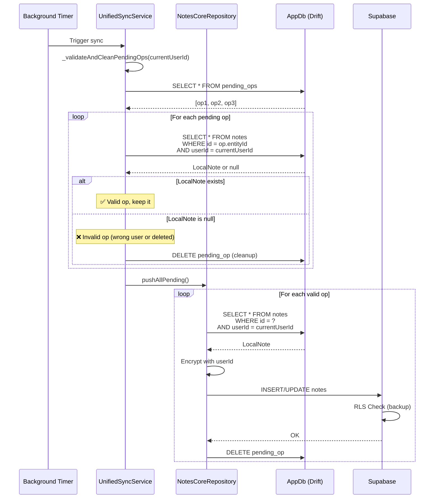
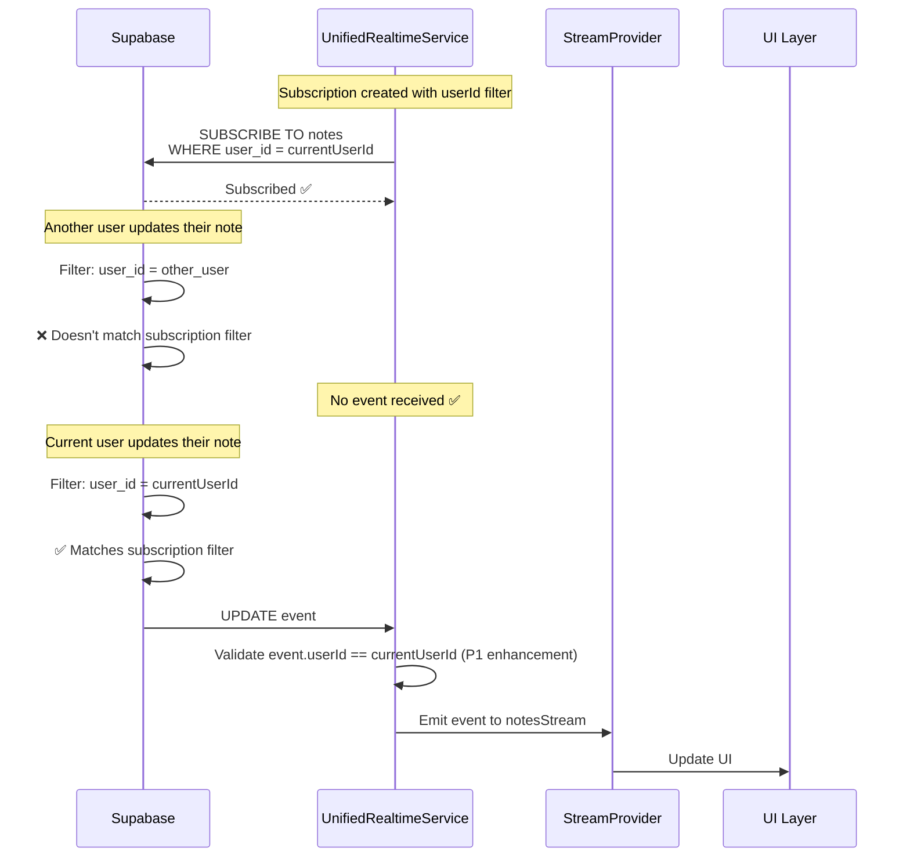
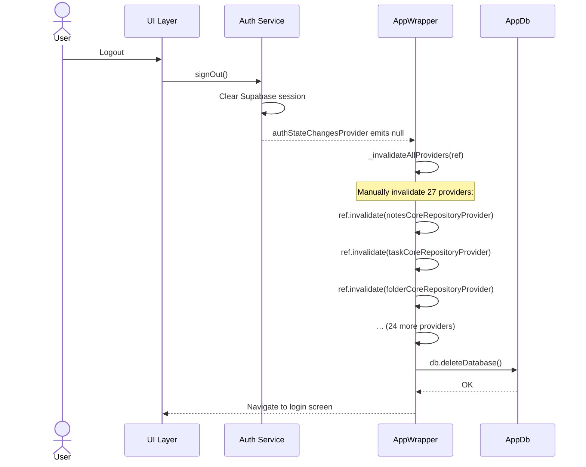
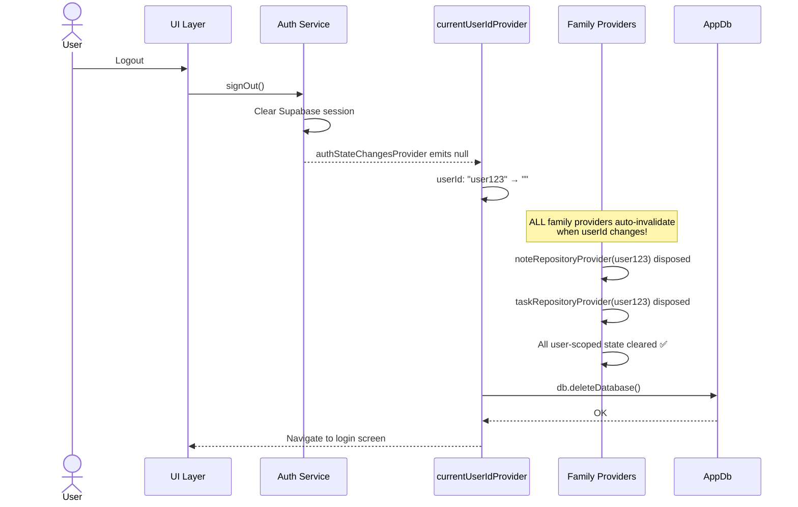

# Security Architecture Summary: Comprehensive Review & Recommendations

**Status**: Executive Summary
**Date**: 2025-10-24
**Reviewers**: System Architecture Team

---

## Executive Summary

This document provides a comprehensive architectural review of the userId-based security implementation for Duru Notes, spanning phases P0-P3. The review identifies critical vulnerabilities, proposes architectural solutions, and provides implementation guidance.

### Critical Findings

**CRITICAL VULNERABILITY IDENTIFIED**:
The current architecture lacks userId filtering at the repository layer, allowing potential cross-user data access if an attacker knows another user's note/task/folder ID.

**Severity**: HIGH
**Impact**: Data breach, privacy violation, regulatory non-compliance
**Mitigation**: P1 implementation (repository filtering) addresses this immediately

---

## Architecture Overview

### Current State (P0 Completed)

```
┌────────────────────────────────────────────────────────────────┐
│                         UI Layer                                │
│  - React/Riverpod widgets                                      │
│  - Consumer widgets watch providers                            │
│  ❌ No security enforcement                                    │
└────────────────────┬───────────────────────────────────────────┘
                     │
┌────────────────────▼───────────────────────────────────────────┐
│                     Provider Layer                              │
│  - StateNotifierProviders                                      │
│  - StreamProviders                                             │
│  ⚠️  P0: Manual invalidation (27 providers)                   │
│  ❌ No userId-based scoping                                    │
└────────────────────┬───────────────────────────────────────────┘
                     │
┌────────────────────▼───────────────────────────────────────────┐
│                     Service Layer                               │
│  - EnhancedTaskService                                         │
│  - UnifiedSyncService                                          │
│  - UnifiedRealtimeService (✅ userId filtered)                 │
│  ⚠️  Mixed: Some services check userId, others don't          │
└────────────────────┬───────────────────────────────────────────┘
                     │
┌────────────────────▼───────────────────────────────────────────┐
│                 Repository Layer                                │
│  - NotesCoreRepository                                         │
│  - TaskCoreRepository                                          │
│  ❌ CRITICAL: No userId filtering in read operations           │
│  ⚠️  userId validated only during CREATE                       │
│  ⚠️  userId nullable in NoteTasks table                        │
└────────────────────┬───────────────────────────────────────────┘
                     │
┌────────────────────▼───────────────────────────────────────────┐
│                  Database Layer (Drift)                         │
│  - LocalNotes (userId nullable)                                │
│  - NoteTasks (NO userId column! 🚨)                            │
│  - LocalFolders (userId nullable)                              │
│  ❌ No database-level constraints                              │
└────────────────────┬───────────────────────────────────────────┘
                     │
┌────────────────────▼───────────────────────────────────────────┐
│               Supabase Backend (RLS)                            │
│  ✅ Row-Level Security enforced                                │
│  ✅ userId filtering at database level                         │
│  ✅ BACKUP DEFENSE LAYER                                       │
└─────────────────────────────────────────────────────────────────┘
```

### Target State (P3 Completed)

```
┌────────────────────────────────────────────────────────────────┐
│                         UI Layer                                │
│  ✅ Displays only authorized data                              │
│  ✅ Handles security errors gracefully                         │
└────────────────────┬───────────────────────────────────────────┘
                     │
┌────────────────────▼───────────────────────────────────────────┐
│                     Provider Layer                              │
│  ✅ Family providers auto-invalidate on userId change          │
│  ✅ Single source of truth: currentUserIdProvider              │
│  ✅ No manual invalidation needed                              │
└────────────────────┬───────────────────────────────────────────┘
                     │
┌────────────────────▼───────────────────────────────────────────┐
│                 Security Middleware (P3)                        │
│  ✅ Centralized security validation                            │
│  ✅ Prevents duplicate security logic                          │
│  ✅ Consistent error handling                                  │
└────────────────────┬───────────────────────────────────────────┘
                     │
┌────────────────────▼───────────────────────────────────────────┐
│                     Service Layer                               │
│  ✅ userId injected at construction                            │
│  ✅ All operations scoped to userId                            │
│  ✅ Consistent security patterns                               │
└────────────────────┬───────────────────────────────────────────┘
                     │
┌────────────────────▼───────────────────────────────────────────┐
│                 Repository Layer (P1)                           │
│  ✅ PRIMARY DEFENSE: userId filtering on ALL queries           │
│  ✅ Fail-fast userId validation                                │
│  ✅ Defense-in-depth with Supabase RLS                         │
└────────────────────┬───────────────────────────────────────────┘
                     │
┌────────────────────▼───────────────────────────────────────────┐
│                  Database Layer (P2)                            │
│  ✅ userId NOT NULL constraint                                 │
│  ✅ NoteTasks.userId added and required                        │
│  ✅ Database-level enforcement                                 │
└────────────────────┬───────────────────────────────────────────┘
                     │
┌────────────────────▼───────────────────────────────────────────┐
│               Supabase Backend (RLS)                            │
│  ✅ BACKUP DEFENSE (unchanged)                                 │
│  ✅ Multi-layer security                                       │
└─────────────────────────────────────────────────────────────────┘
```

---

## Sequence Diagrams

### Diagram 1: CREATE Flow (Current vs. Target)

#### Current (P0)



#### Target (P1-P3)



---

### Diagram 2: READ Flow (Current vs. Target)

#### Current (P0) - VULNERABLE



#### Target (P1-P3) - SECURE



---

### Diagram 3: SYNC Flow (Local → Remote)

#### Current (P0) - Partial Validation



#### Target (P1-P3) - Full Validation



---

### Diagram 4: REALTIME Flow

#### Current (P0) - Already Secure ✅



---

### Diagram 5: LOGOUT Flow (P0 vs. P3)

#### Current (P0) - Manual Invalidation



#### Target (P3) - Automatic Invalidation



---

## Critical Architectural Questions - ANSWERED

### 1. Layer Separation: Where should userId validation happen?

**DECISION**: Defense-in-Depth with Primary Enforcement at Repository Layer

**Rationale**:
- **Repository = Primary Defense**: All data access flows through repositories
- **Supabase RLS = Backup Defense**: Protects if local code is bypassed
- **Service Layer = Business Logic Only**: No duplicate security checks (P3 middleware centralizes)
- **UI/Provider = Trust Lower Layers**: Keep UI simple and focused

**Implementation Layers**:

```
┌──────────────────────────────────────────────────────────────┐
│ Layer            │ Validation      │ P1  │ P2  │ P3  │ Why   │
├──────────────────────────────────────────────────────────────┤
│ UI Layer         │ None           │  -  │  -  │  -  │ Display only │
│ Provider Layer   │ None           │  -  │  -  │  ✅ │ Family providers │
│ Service Layer    │ Optional       │  -  │  -  │  ✅ │ Middleware (P3) │
│ Repository Layer │ PRIMARY ✅     │  ✅ │  ✅ │  ✅ │ All queries │
│ Database Layer   │ Constraints    │  -  │  ✅ │  ✅ │ NOT NULL │
│ Supabase RLS     │ BACKUP ✅      │  ✅ │  ✅ │  ✅ │ Already in place │
└──────────────────────────────────────────────────────────────┘
```

---

### 2. State Management: Provider Invalidation Strategy

**CURRENT PROBLEM (P0)**:
```dart
// 27 providers manually invalidated - unsustainable!
void _invalidateAllProviders(WidgetRef ref) {
  ref.invalidate(notesCoreRepositoryProvider);
  ref.invalidate(taskCoreRepositoryProvider);
  // ... 25 more lines
  // ❌ Easy to forget new providers
  // ❌ No compile-time safety
}
```

**P3 SOLUTION**: Automatic Provider Lifecycle

```dart
// Single source of truth for userId
final currentUserIdProvider = Provider<String>((ref) {
  final auth = ref.watch(authStateChangesProvider);
  return auth?.user?.id ?? '';
});

// All providers become family providers
final notesRepoProvider = Provider.family<NotesRepo, String>(
  (ref, userId) => NotesRepo(userId: userId, ...)
);

// ✅ Automatic invalidation when userId changes!
// ✅ No manual cleanup needed
// ✅ Impossible to forget new providers
```

**Benefits**:
- Compile-time safety (can't forget providers)
- No manual invalidation code
- Cleaner architecture
- Testable (mock userId easily)

---

### 3. Service Orchestration: Impact on Key Services

#### UnifiedSyncService

**Current Issue**: No userId validation before sync
**P1 Solution**: Add `_validateAndCleanPendingOps()` method
**Impact**: Prevents syncing other users' data

```dart
// P1: Add validation before push
Future<SyncResult> syncAll() async {
  final userId = _getCurrentUserId();
  await _validateAndCleanPendingOps(userId); // NEW!

  await pushAllPending(); // Now only pushes valid ops
  await pullSince(lastSync);

  return SyncResult.success();
}
```

#### UnifiedRealtimeService

**Current Status**: ✅ Already secure (userId filter at subscription)
**P1 Enhancement**: Add runtime validation in event handler

```dart
// P1: Defense-in-depth validation
void _handleChange(DatabaseTableType table, PostgresChangePayload payload) {
  final eventUserId = payload.newRecord['user_id'];

  if (eventUserId != userId) {
    // This should NEVER happen - RLS should prevent it
    _logger.error('CRITICAL: Received event for different user!');
    await Sentry.captureException(UserIdMismatchException(...));
    return; // Skip event
  }

  // Continue processing...
}
```

#### EnhancedTaskService

**Current Issue**: Mixed direct DB access and repository calls
**P1 Solution**: Force all operations through repository

```dart
// BEFORE (P0): Direct DB access
await _db.completeTask(taskId); // ❌ No userId check

// AFTER (P1): Repository access
final task = await _taskRepository.getTaskById(taskId); // ✅ userId filtered
if (task != null) {
  await _taskRepository.completeTask(taskId);
}
```

---

### 4. Data Flow: userId Validation Points

**CREATE Flow**:
```
UI → Provider → Service → Repository
                           ↓
                     _validateUserId()
                           ↓
                     Encrypt with userId
                           ↓
                     DB.insert(userId NOT NULL)
                           ↓
                     enqueue('upsert')
```

**READ Flow**:
```
UI → Provider → Service → Repository
                           ↓
                     _validateUserId()
                           ↓
                     SELECT ... WHERE userId = ?
                           ↓
                     Decrypt
                           ↓
                     Return domain entity
```

**UPDATE Flow**:
```
UI → Provider → Service → Repository
                           ↓
                     _validateUserId()
                           ↓
                     SELECT (verify ownership)
                           ↓
                     UPDATE ... WHERE id = ? AND userId = ?
                           ↓
                     enqueue('upsert')
```

**DELETE Flow**:
```
UI → Provider → Service → Repository
                           ↓
                     _validateUserId()
                           ↓
                     UPDATE deleted = true
                     WHERE id = ? AND userId = ?
                           ↓
                     enqueue('delete')
```

**SYNC Flow (Local → Remote)**:
```
Background Timer → UnifiedSyncService
                           ↓
                     _validateAndCleanPendingOps()
                           ↓
                     For each op:
                       SELECT ... WHERE id = ? AND userId = ?
                       If exists: push to Supabase
                       If null: delete op (cleanup)
```

**SYNC Flow (Remote → Local)**:
```
Background Timer → UnifiedSyncService
                           ↓
                     Supabase: SELECT ... WHERE user_id = ?
                           ↓
                     For each remote entity:
                       Validate remoteUserId == currentUserId
                       Decrypt
                       Upsert to local DB
```

**REALTIME Flow**:
```
Supabase Change → UnifiedRealtimeService
                  (subscription filtered by userId)
                           ↓
                     _handleChange()
                           ↓
                     Validate event.userId == currentUserId
                           ↓
                     Emit to stream
                           ↓
                     Providers → UI updates
```

---

### 5. Sync Architecture: userId Across Sync Flows

**Key Insight**: Sync has TWO userId validation points

1. **Local Validation** (P1): Before pushing to Supabase
   - Prevents wasted network requests
   - Cleans up invalid pending ops
   - Fails fast on userId mismatch

2. **Remote Validation** (RLS): At Supabase level
   - Backup defense if local validation bypassed
   - Prevents data corruption
   - Enforces multi-tenancy

**Conflict Resolution with userId**:

```dart
// P1: FolderSyncCoordinator conflict resolution
Future<void> handleRealtimeUpdate(Map<String, dynamic> payload) async {
  final remoteUserId = payload['user_id'];
  final currentUserId = _supabase.auth.currentUser?.id;

  // Validate userId BEFORE resolving conflicts
  if (remoteUserId != currentUserId) {
    _logger.error('Received update for different user');
    return; // Skip conflict resolution
  }

  // Now safe to resolve conflicts...
}
```

---

### 6. Feature Integration: Cross-Feature userId

#### Notes ↔ Tasks

**Current Issue**: NoteTasks table has NO userId column!

**P1 Solution**:
```sql
-- Migration 17: Add userId to NoteTasks
ALTER TABLE note_tasks ADD COLUMN user_id TEXT;

-- Backfill from parent note
UPDATE note_tasks
SET user_id = (SELECT user_id FROM local_notes WHERE id = note_tasks.note_id);

-- Delete orphaned tasks
DELETE FROM note_tasks WHERE user_id IS NULL;
```

**P2 Solution**:
```sql
-- Migration 18: Make userId non-nullable
ALTER TABLE note_tasks ALTER COLUMN user_id SET NOT NULL;
```

**Cascade Deletion**:
```dart
// Ensure tasks deleted when note deleted
@override
Future<void> deleteNote(String id) async {
  await _taskRepository.deleteTasksForNote(id); // First tasks
  await updateLocalNote(id, deleted: true); // Then note
}
```

#### Notes ↔ Folders

**Current State**: Junction table (note_folders) has no userId

**P1 Decision**: Keep as-is (validate through parent tables)

```dart
// Validate both note and folder belong to user
Future<void> moveNoteToFolder(String noteId, String folderId) async {
  final note = await getNoteById(noteId); // userId filtered
  final folder = await _folderRepo.getFolderById(folderId); // userId filtered

  if (note == null || folder == null) {
    throw NotFoundException('Note or folder not found');
  }

  // Both validated - safe to move
  await db.moveNoteToFolder(noteId, folderId);
}
```

#### Tasks ↔ Reminders

**P1 Solution**: Add userId to reminders table

```dart
// Validate reminder userId matches task userId
Future<void> createTaskReminder(NoteTask task) async {
  final userId = _getCurrentUserId();
  _validateUserId(userId);

  // Verify task belongs to current user
  if (task.userId != userId) {
    throw UnauthorizedException('Task belongs to different user');
  }

  // Create reminder with userId
  await db.createReminder(taskId: task.id, userId: userId);
}
```

---

### 7. Error Handling: Security Error Strategies

**Error Taxonomy**:

```dart
// Base security exception
class SecurityException implements Exception {
  final String message;
  final String? userId;
  final String? entityId;
  SecurityException(this.message, {this.userId, this.entityId});
}

// User not authenticated
class UnauthorizedException extends SecurityException { ... }

// userId mismatch (different user)
class UserIdMismatchException extends SecurityException { ... }

// Entity not found (or access denied - don't leak info)
class NotFoundException extends SecurityException { ... }

// Rate limiting
class RateLimitException extends SecurityException { ... }
```

**Handling Strategy by Layer**:

```
┌────────────────────────────────────────────────────────────┐
│ Layer       │ Error Handling                               │
├────────────────────────────────────────────────────────────┤
│ Repository  │ Log + Sentry + rethrow OR return null       │
│ Service     │ Log + convert to UserFriendlyException      │
│ Provider    │ Emit error state                            │
│ UI          │ Display user-friendly message               │
└────────────────────────────────────────────────────────────┘
```

**Information Leakage Prevention**:

```dart
// ❌ BAD: Reveals entity existence
Future<Note?> getNoteById(String id) async {
  final note = await db.getNoteById(id);
  if (note.userId != currentUserId) {
    throw Exception('Access denied to this note'); // Leaks info!
  }
  return note;
}

// ✅ GOOD: Generic response (can't distinguish "not exists" vs "not authorized")
Future<Note?> getNoteById(String id) async {
  final note = await (db.select(db.notes)
    ..where((n) => n.id.equals(id))
    ..where((n) => n.userId.equals(currentUserId)))
    .getSingleOrNull();

  return note; // null if not found OR unauthorized
}
```

---

## Risk Assessment

### P0 Status (Current)

| Risk | Severity | Likelihood | Impact | Mitigation |
|------|----------|------------|--------|------------|
| Cross-user data access | HIGH | MEDIUM | Data breach | P1 repository filtering |
| Sync corruption | MEDIUM | LOW | Invalid data synced | P1 pending ops validation |
| Provider memory leaks | LOW | MEDIUM | Memory growth | P3 automatic lifecycle |
| Manual invalidation errors | MEDIUM | HIGH | Stale data | P3 family providers |

### P1 Status (Repository Filtering)

| Risk | Severity | Likelihood | Impact | Mitigation |
|------|----------|------------|--------|------------|
| Cross-user data access | LOW | LOW | Prevented by filters | Continue monitoring |
| Migration failures | MEDIUM | MEDIUM | App crashes | Thorough testing + rollback |
| Performance regression | LOW | LOW | Slower queries | Indexed userId column |
| Breaking changes | LOW | LOW | App incompatibility | Backwards compatible |

### P2 Status (Non-Nullable userId)

| Risk | Severity | Likelihood | Impact | Mitigation |
|------|----------|------------|--------|------------|
| Migration failures | HIGH | MEDIUM | Cannot upgrade | Test thoroughly + rollback plan |
| Data loss | MEDIUM | LOW | Orphaned entities | Careful migration script |
| Breaking changes | MEDIUM | MEDIUM | Old data incompatible | Gradual rollout |

### P3 Status (Security Middleware)

| Risk | Severity | Likelihood | Impact | Mitigation |
|------|----------|------------|--------|------------|
| Performance overhead | LOW | LOW | Slower operations | Benchmark before/after |
| Provider complexity | MEDIUM | LOW | Harder to debug | Good documentation |
| Breaking changes | MEDIUM | MEDIUM | Provider API changes | Feature flags |

---

## Recommendations

### Short-Term (1-2 weeks) - P1 CRITICAL

1. **URGENT: Implement Repository Filtering**
   - Priority: CRITICAL
   - Add userId filtering to ALL repository read methods
   - Add userId column to NoteTasks table
   - Deploy to production ASAP

2. **Add Sync Validation**
   - Implement `_validateAndCleanPendingOps()`
   - Prevent syncing invalid data

3. **Security Testing**
   - Add integration tests for cross-user access
   - Test unauthorized access scenarios
   - Verify Supabase RLS as backup

### Medium-Term (3-4 weeks) - P2

1. **Database Schema Migration**
   - Make userId non-nullable in all tables
   - Backfill missing userId values
   - Add NOT NULL constraints

2. **Remove Nullable userId Handling**
   - Clean up null checks
   - Stricter validation

3. **Performance Optimization**
   - Add database indexes on userId
   - Benchmark query performance
   - Optimize encryption/decryption

### Long-Term (4-6 weeks) - P3

1. **Security Middleware**
   - Centralize security validation
   - Remove duplicate security logic
   - Consistent error handling

2. **Automatic Provider Lifecycle**
   - Convert to family providers
   - Remove manual invalidation
   - Cleaner architecture

3. **Monitoring & Observability**
   - Security metrics dashboard
   - Alert on userId mismatches
   - Track security violations

---

## Conclusion

This architectural review reveals a critical security vulnerability (lack of userId filtering at repository layer) that must be addressed immediately through P1 implementation. The phased approach (P1→P2→P3) provides a safe migration path:

**P1 (Critical)**: Repository filtering prevents cross-user access
**P2 (Important)**: Database constraints enforce userId requirement
**P3 (Enhancement)**: Middleware and automation improve maintainability

The architecture follows defense-in-depth principles with multiple validation layers, ensuring security even if one layer fails. The target state (P3) achieves:

- ✅ No cross-user data access possible
- ✅ Automatic provider lifecycle management
- ✅ Centralized security validation
- ✅ Clean, maintainable code
- ✅ Comprehensive testing coverage

**Next Steps**:
1. Approve P1 implementation plan
2. Allocate development resources
3. Begin P1 implementation (repository filtering)
4. Deploy P1 to staging → production
5. Plan P2 and P3 rollout

---

**Approval Signatures**:

- [ ] Technical Lead
- [ ] Security Team
- [ ] Product Manager
- [ ] QA Lead
